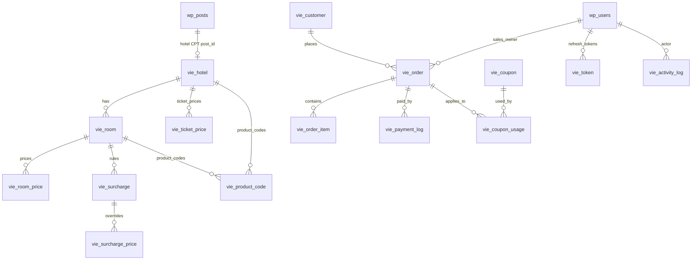

# 02 — Database Schema

## 2.1. Quy tắc đặt tên & dữ liệu

- Prefix: `{$wpdb->prefix}vie_*`.
- Engine: **InnoDB**, collation **utf8mb4_unicode_ci**.
- Tiền VND: `DECIMAL(12,0)` (không lưu phần thập phân).
- Phần trăm / hệ số: `DECIMAL(7,2)` (vd `99.99%`).
- Snapshot/policy: `LONGTEXT` JSON cho an toàn MySQL cũ; chuyển sang `JSON` native chỉ khi production OK.
- `created_at` / `updated_at` mặc định `CURRENT_TIMESTAMP`, `updated_at` `ON UPDATE CURRENT_TIMESTAMP`.
- **Không khai báo foreign key** ở cấp DB — enforce ở Service + index `KEY`.
- ID: `BIGINT UNSIGNED AUTO_INCREMENT PRIMARY KEY`.

## 2.2. ERD



## 2.3. Danh sách bảng

| # | Bảng | Mô tả |
|---|---|---|
| 1 | `vie_hotel` | Bản ghi khách sạn, sync với CPT `hotel` |
| 2 | `vie_room` | Loại phòng / hạng phòng thuộc hotel |
| 3 | `vie_room_price` | Giá phòng và tồn kho theo ngày |
| 4 | `vie_surcharge` | Rule phụ thu adult/child theo phòng |
| 5 | `vie_surcharge_price` | Override phụ thu theo ngày |
| 6 | `vie_ticket_price` | Giá vé combo theo hotel × ngày |
| 7 | `vie_product_code` | Mapping `SP0133` → biến thể hotel/room/booking_type |
| 8 | `vie_customer` | Khách hàng — `phone` là business identifier |
| 9 | `vie_order` | Đơn hàng header (= booking) |
| 10 | `vie_order_item` | Line item: phòng/combo |
| 11 | `vie_payment_log` | Sổ cái thanh toán (immutable ledger) |
| 12 | `vie_coupon` | Mã giảm giá |
| 13 | `vie_coupon_usage` | Lượt sử dụng coupon |
| 14 | `vie_token` | Refresh token cho SPA auth |
| 15 | `vie_activity_log` | Audit log cho thao tác admin/sales |

## 2.4. `vie_hotel`

Mỗi hotel = 1 dòng, đồng bộ với 1 WP post `hotel` (CPT) cho SEO/single page.

| Cột | Kiểu | Bắt buộc | Ghi chú |
|---|---|---|---|
| `id` | BIGINT UNSIGNED PK | có | |
| `post_id` | BIGINT UNSIGNED UNIQUE | có | `wp_posts.ID`, post_type=`hotel` |
| `name` | VARCHAR(255) | có | Sync từ post_title (override được trong admin SPA) |
| `slug` | VARCHAR(255) | có | Sync từ post_name |
| `description` | TEXT | không | |
| `address` | VARCHAR(500) | không | |
| `city` | VARCHAR(100) | không | VT / MN / HT / PH (workbook) — code khu vực |
| `contact_phone` | VARCHAR(50) | không | |
| `contact_email` | VARCHAR(255) | không | |
| `star_rating` | TINYINT UNSIGNED | không | 1–5 |
| `default_checkin` | TIME | có | mặc định `14:00:00` |
| `default_checkout` | TIME | có | mặc định `12:00:00` |
| `default_ticket_price` | DECIMAL(12,0) | có | dự phòng nếu thiếu `vie_ticket_price` |
| `ticket_free_children_count` | TINYINT UNSIGNED | có | **mặc định `1`** — yêu cầu mới (1 booking ≤ 1 bé miễn vé) |
| `ticket_free_children_max_age` | TINYINT UNSIGNED | có | **mặc định `5`** — "bé < 6 tuổi" |
| `pricing_policy` | LONGTEXT JSON | không | xem §2.4.1 |
| `cancellation_policy` | LONGTEXT JSON | không | xem §2.4.2 |
| `thumbnail_id` | BIGINT UNSIGNED | không | WP attachment |
| `gallery` | LONGTEXT JSON | không | mảng `attachment_id` |
| `is_active` | TINYINT(1) | có | |
| `sort_order` | SMALLINT | có | |
| `created_at` / `updated_at` | DATETIME | có | |

**Index**: `UNIQUE(post_id)`, `KEY(slug)`, `KEY(city)`, `KEY(is_active)`, `KEY(sort_order)`.

### 2.4.1. `pricing_policy` JSON

```json
{
  "child_note": "Trẻ dưới 6 tuổi miễn phí 01 bé (phòng và vé). Bé thứ 2 tính phí phụ thu.",
  "extra_bed_note": "Phụ thu giường phụ: 300.000 VND/đêm.",
  "ticket_note": "Giá vé đã bao gồm xe khứ hồi Sài Gòn – Vũng Tàu.",
  "general_notes": [
    "Giá không áp dụng ngày lễ, Tết.",
    "Giá có thể thay đổi theo mùa."
  ]
}
```

### 2.4.2. `cancellation_policy` JSON

```json
{
  "rules": [
    {"hours_before_checkin": 72, "penalty_percent": 0,   "description": "Hủy trước 72h: miễn phí"},
    {"hours_before_checkin": 24, "penalty_percent": 50,  "description": "Hủy trước 24–72h: phạt 50%"},
    {"hours_before_checkin": 0,  "penalty_percent": 100, "description": "Hủy trong 24h hoặc no-show: mất 100%"}
  ],
  "refund_method": "Hoàn tiền qua chuyển khoản trong 5–7 ngày làm việc.",
  "notes": "Không áp dụng hoàn tiền cho đặt phòng khuyến mãi."
}
```

Quy tắc tính refund: sort `rules` DESC theo `hours_before_checkin`, chọn rule đầu tiên thoả `delta_hours >= hours_before_checkin`. Nếu không khớp → áp `penalty_percent: 100`.

## 2.5. `vie_room`

| Cột | Kiểu | Bắt buộc | Ghi chú |
|---|---|---|---|
| `id` | BIGINT UNSIGNED PK | có | |
| `hotel_id` | BIGINT UNSIGNED | có | → `vie_hotel.id` |
| `name` | VARCHAR(255) | có | |
| `description` | LONGTEXT | không | |
| `included_adults` | TINYINT UNSIGNED | có | NL chuẩn nằm trong giá |
| `max_adults` | TINYINT UNSIGNED | có | NL tối đa = chuẩn + extra |
| `max_children` | TINYINT UNSIGNED | có | TE thêm ngoài chỗ NL |
| `base_price` | DECIMAL(12,0) | có | giá đêm dự phòng |
| `extra_adult_price` | DECIMAL(12,0) | có | phụ thu NL dự phòng |
| `free_children_count` | TINYINT UNSIGNED | có | TE miễn phí / **phòng** (workbook: 1 hoặc 2) |
| `free_children_max_age` | TINYINT UNSIGNED | có | mặc định `5` |
| `area` | SMALLINT UNSIGNED | không | m² |
| `bed_type` | VARCHAR(50) | không | single/double/twin/king/queen/bunk |
| `bed_count` | TINYINT UNSIGNED | không | |
| `view` | VARCHAR(100) | không | biển/hồ bơi/vườn/thành phố/núi |
| `floor` | VARCHAR(50) | không | |
| `amenities` | LONGTEXT JSON | không | `["wifi","tv","minibar",...]` |
| `thumbnail_id` | BIGINT UNSIGNED | không | |
| `gallery` | LONGTEXT JSON | không | |
| `is_active` | TINYINT(1) | có | |
| `sort_order` | SMALLINT | có | |
| `created_at` / `updated_at` | DATETIME | có | |

**Index**: `KEY(hotel_id)`, `KEY(is_active)`, `KEY(sort_order)`.

> Hai trường `free_children_count` & `free_children_max_age` ở phòng dùng cho **tiền phòng**; cặp `ticket_free_children_*` ở `vie_hotel` dùng cho **vé xe**. Hai cơ chế tách biệt, đáp ứng yêu cầu mới (booking ≤ 1 bé miễn vé).

## 2.6. `vie_room_price`

| Cột | Kiểu | Bắt buộc | Ghi chú |
|---|---|---|---|
| `id` | BIGINT UNSIGNED PK | có | |
| `room_id` | BIGINT UNSIGNED | có | |
| `date` | DATE | có | ngày đêm nghỉ; ngày checkout **không** tính |
| `price` | DECIMAL(12,0) | có | giá / đêm |
| `extra_adult_price` | DECIMAL(12,0) | có | override `vie_room.extra_adult_price` |
| `stock` | SMALLINT UNSIGNED | có | số phòng bán được |
| `is_active` | TINYINT(1) | có | |
| `source` | VARCHAR(30) | có | `manual`/`weekday_rule`/`holiday_override`/`import` |
| `created_at` / `updated_at` | DATETIME | có | |

**Index**: `UNIQUE(room_id, date)`, `KEY(date)`, `KEY(room_id, date, is_active)`.

**Quy tắc**: pricing/booking **chỉ chấp nhận đêm có row `is_active=1`**. Không có row → stock = 0 → từ chối. Đây là khác biệt rõ ràng so với hành vi cũ.

## 2.7. `vie_surcharge`

Rule phụ thu theo phòng (template). Giá nằm ở cột `amount` (giá mặc định), hoặc override ngày trong `vie_surcharge_price.amount`.

| Cột | Kiểu | Bắt buộc | Ghi chú |
|---|---|---|---|
| `id` | BIGINT UNSIGNED PK | có | |
| `room_id` | BIGINT UNSIGNED | có | |
| `guest_type` | VARCHAR(10) | có | `adult` / `child` |
| `label` | VARCHAR(100) | có | "Trẻ 6–11 tuổi" |
| `age_from` | TINYINT UNSIGNED | có | với adult: 18–99 hoặc 0–0 |
| `age_to` | TINYINT UNSIGNED | có | |
| `amount` | DECIMAL(12,0) | có | / đêm |
| `is_free` | TINYINT(1) | có | override miễn phí cấp rule |
| `sort_order` | SMALLINT | có | rule active **khớp đầu tiên** thắng |
| `is_active` | TINYINT(1) | có | |
| `created_at` / `updated_at` | DATETIME | có | |

**Index**: `KEY(room_id)`, `KEY(room_id, guest_type, is_active, sort_order)`.

## 2.8. `vie_surcharge_price`

| Cột | Kiểu | Bắt buộc | Ghi chú |
|---|---|---|---|
| `id` | BIGINT UNSIGNED PK | có | |
| `surcharge_id` | BIGINT UNSIGNED | có | |
| `date` | DATE | có | |
| `amount` | DECIMAL(12,0) | có | |
| `is_active` | TINYINT(1) | có | |
| `created_at` / `updated_at` | DATETIME | có | |

**Index**: `UNIQUE(surcharge_id, date)`, `KEY(date)`.

## 2.9. `vie_ticket_price`

Giá vé xe khứ hồi theo hotel × ngày (route reserved cho tương lai).

| Cột | Kiểu | Bắt buộc | Ghi chú |
|---|---|---|---|
| `id` | BIGINT UNSIGNED PK | có | |
| `hotel_id` | BIGINT UNSIGNED | có | |
| `route_id` | BIGINT UNSIGNED | có | mặc định `0` (single route hiện tại) |
| `date` | DATE | có | |
| `ticket_price` | DECIMAL(12,0) | có | / khách / **khứ hồi** |
| `is_active` | TINYINT(1) | có | |
| `created_at` / `updated_at` | DATETIME | có | |

**Index**: `UNIQUE(hotel_id, route_id, date)`, `KEY(date)`.

## 2.10. `vie_product_code`

Map mã `SP0133`, `SP1042` từ workbook → biến thể.

| Cột | Kiểu | Bắt buộc | Ghi chú |
|---|---|---|---|
| `id` | BIGINT UNSIGNED PK | có | |
| `code` | VARCHAR(50) UNIQUE | có | |
| `hotel_id` | BIGINT UNSIGNED | có | |
| `room_id` | BIGINT UNSIGNED | có | |
| `booking_type` | VARCHAR(10) | có | `room` / `combo` |
| `weekday_pattern` | VARCHAR(30) | không | `CN-T5`, `T6-T7`, `T7` |
| `display_name` | VARCHAR(255) | có | tên hiển thị print/quote |
| `unit_label` | VARCHAR(50) | có | `Phòng` / `Số Combo` |
| `is_active` | TINYINT(1) | có | |
| `created_at` / `updated_at` | DATETIME | có | |

**Index**: `UNIQUE(code)`, `KEY(hotel_id)`, `KEY(room_id)`, `KEY(booking_type)`.

## 2.11. `vie_customer`

| Cột | Kiểu | Bắt buộc | Ghi chú |
|---|---|---|---|
| `id` | BIGINT UNSIGNED PK | có | |
| `phone` | VARCHAR(50) UNIQUE | có | business identifier |
| `name` | VARCHAR(255) | có | |
| `email` | VARCHAR(255) | không | |
| `note` | TEXT | không | |
| `vat_company_name` | VARCHAR(255) | không | |
| `vat_tax_code` | VARCHAR(50) | không | |
| `vat_address` | VARCHAR(500) | không | |
| `vat_email` | VARCHAR(255) | không | |
| `booking_count` | INT UNSIGNED | có | counter cập nhật khi order completed |
| `created_at` / `updated_at` | DATETIME | có | |

**Index**: `UNIQUE(phone)`, `KEY(email)`.

> Phone chuẩn hoá: bỏ space, ký tự đặc biệt; giữ leading `+` nếu có (số quốc tế).

## 2.12. `vie_order`

Header đơn. UI public có thể gọi là "booking", admin gọi "đơn hàng".

| Cột | Kiểu | Bắt buộc | Ghi chú |
|---|---|---|---|
| `id` | BIGINT UNSIGNED PK | có | |
| `code` | VARCHAR(20) UNIQUE | có | **"Mã đặt phòng"** — `VIEyymmddXXXX` (xem [04-business-rules.md](04-business-rules.md)) |
| `idempotency_key` | VARCHAR(64) UNIQUE | không | chống trùng submit public |
| `customer_id` | BIGINT UNSIGNED | có | |
| `customer_phone` | VARCHAR(50) | có | snapshot tại thời điểm tạo đơn |
| `customer_name` | VARCHAR(255) | có | snapshot — không tự update khi `vie_customer.name` đổi |
| `customer_email` | VARCHAR(255) | không | snapshot |
| `customer_vat` | LONGTEXT JSON | không | snapshot `{company_name, tax_code, address, email}` — null nếu không xuất hoá đơn |
| `sales_user_id` | BIGINT UNSIGNED | không | `wp_users.ID` nhân viên sales |
| `source` | VARCHAR(50) | có | `website` / `facebook` / `tiktok` / `zalo` / `hotline` / `mail` / `repurchase` / `direct` |
| `checkin` | DATE | có | min của items |
| `checkout` | DATE | có | max của items |
| `nights` | TINYINT UNSIGNED | có | |
| `adults` | TINYINT UNSIGNED | có | tổng cấp request |
| `children` | TINYINT UNSIGNED | có | |
| `child_ages` | LONGTEXT JSON | không | `[5,7,9]` |
| `customer_note` | TEXT | không | |
| `internal_note` | TEXT | không | admin/sales |
| `pickup` | LONGTEXT JSON | không | `{date,time,address,note}` |
| `dropoff` | LONGTEXT JSON | không | `{date,time,address,note}` |
| `subtotal` | DECIMAL(12,0) | có | trước giảm |
| `discount` | DECIMAL(12,0) | có | coupon + manual |
| `tax` | DECIMAL(12,0) | có | mặc định 0 |
| `total` | DECIMAL(12,0) | có | tiền khách phải trả |
| `cost_total` | DECIMAL(12,0) | không | = Σ `order_item.cost_total`, mặc định 0 |
| `profit_total` | DECIMAL(12,0) | không | `total − cost_total` |
| `currency` | CHAR(3) | có | `VND` |
| `coupon_id` | BIGINT UNSIGNED | không | |
| `coupon_code` | VARCHAR(50) | không | snapshot |
| `payment_status` | VARCHAR(20) | có | `pending` / `partial` / `paid` — derive từ ledger (xem [10-payment-sepay.md §10.1](10-payment-sepay.md#101-triết-lý-sổ-cái-immutable)). Refund / void chỉ làm `paid_amount` giảm, KHÔNG sinh state mới. |
| `paid_amount` | DECIMAL(12,0) | có | từ ledger |
| `paid_at` | DATETIME | không | set khi đủ |
| `partner_payment_status` | VARCHAR(30) | có | `not_created` / `created` / `deposit_paid` / `paid` |
| `invoice_number` | VARCHAR(100) | không | workbook "Số Hóa Đơn" |
| `voucher_code` | VARCHAR(100) | không | workbook "Mã Voucher" |
| `status` | VARCHAR(20) | có | `pending` / `confirmed` / `cancelled` / `completed` / `no_show` |
| `confirmed_at` | DATETIME | không | |
| `cancelled_at` | DATETIME | không | |
| `cancel_reason` | TEXT | không | |
| `completed_at` | DATETIME | không | |
| `created_by` | BIGINT UNSIGNED | không | WP user, 0 = guest |
| `ip` | VARCHAR(45) | không | IPv4/IPv6 |
| `user_agent` | VARCHAR(500) | không | |
| `created_at` / `updated_at` | DATETIME | có | |

**Index**: `UNIQUE(code)`, `UNIQUE(idempotency_key)`, `KEY(customer_phone)`, `KEY(sales_user_id)`, `KEY(source)`, `KEY(checkin)`, `KEY(created_at)`, `KEY(status)`, `KEY(payment_status)`.

## 2.13. `vie_order_item`

1 order ≥ 1 item. Workbook có case 1 order chứa 2 line (cùng `DH0513`).

| Cột | Kiểu | Bắt buộc | Ghi chú |
|---|---|---|---|
| `id` | BIGINT UNSIGNED PK | có | |
| `order_id` | BIGINT UNSIGNED | có | |
| `hotel_id` | BIGINT UNSIGNED | có | |
| `room_id` | BIGINT UNSIGNED | có | |
| `product_code_id` | BIGINT UNSIGNED | không | → `vie_product_code.id` |
| `product_code` | VARCHAR(50) | không | snapshot |
| `name` | VARCHAR(255) | có | snapshot tên SP |
| `booking_type` | VARCHAR(10) | có | `room` / `combo` |
| `unit_label` | VARCHAR(50) | có | `Phòng` / `Số Combo` |
| `quantity` | SMALLINT UNSIGNED | có | số phòng/combo = `pricing_snapshot.rooms_allocated`. Server-computed từ quote; client KHÔNG gửi giá trị này khi POST. |
| `checkin` / `checkout` | DATE | có | |
| `nights` | TINYINT UNSIGNED | có | |
| `adults` | TINYINT UNSIGNED | có | phân bổ |
| `children` | TINYINT UNSIGNED | có | phân bổ |
| `child_ages` | LONGTEXT JSON | không | phân bổ |
| `room_subtotal` | DECIMAL(12,0) | có | |
| `extra_adult_total` | DECIMAL(12,0) | có | |
| `child_surcharge_total` | DECIMAL(12,0) | có | |
| `ticket_count` | SMALLINT UNSIGNED | có | **Số chỗ ngồi / Số vé tính** — dùng cho email admin (yêu cầu mới) |
| `ticket_subtotal` | DECIMAL(12,0) | có | tổng tiền vé |
| `line_discount` | DECIMAL(12,0) | có | |
| `line_total` | DECIMAL(12,0) | có | thành tiền |
| `cost_total` | DECIMAL(12,0) | không | giá vốn line, mặc định 0 |
| `profit_total` | DECIMAL(12,0) | không | `line_total − cost_total` |
| `partner_name` | VARCHAR(255) | không | workbook "Đối tác" |
| `hotel_area` | VARCHAR(50) | không | workbook "Khách sạn ở đâu?" |
| `supplier_booking_code` | VARCHAR(100) | không | workbook "Mã đặt phòng" (mã của KS đối tác, khác với `order.code`) |
| `pricing_snapshot` | LONGTEXT JSON | có | bảng tính từng đêm — xem §2.13.1 |
| `status` | VARCHAR(20) | có | `active` / `cancelled` |
| `cancelled_at` | DATETIME | không | |
| `cancel_reason` | TEXT | không | |
| `created_at` / `updated_at` | DATETIME | có | |

**Index**: `KEY(order_id)`, `KEY(hotel_id)`, `KEY(room_id)`, `KEY(product_code)`, `KEY(checkin)`.

### 2.13.1. `pricing_snapshot` JSON

```json
{
  "rooms_allocated": 1,
  "seat_count": 4,
  "billable_seats": 3,
  "free_child_seats": 1,
  "extra_adult_beds": 1,
  "nightly": [
    {
      "date": "2026-06-15",
      "price": 1500000,
      "extra_adult_price": 300000,
      "ticket_price": 350000,
      "child_surcharges": [
        {"label":"Trẻ 6–11","age":8,"amount":150000}
      ]
    }
  ],
  "child_assessments": [
    {"age": 5, "is_free": true,  "treated_as_adult": false},
    {"age": 7, "is_free": false, "treated_as_adult": true}
  ]
}
```

> `supplier_booking_code` (mã đối tác) ≠ `order.code` (mã hệ thống). `order.code` là mã đối soát SePay, gửi cho khách. `supplier_booking_code` admin nhập sau khi khách sạn cấp.

## 2.14. `vie_payment_log`

Xem chi tiết quy tắc sổ cái trong [10-payment-sepay.md](10-payment-sepay.md).

| Cột | Kiểu | Bắt buộc | Ghi chú |
|---|---|---|---|
| `id` | BIGINT UNSIGNED PK | có | |
| `order_id` | BIGINT UNSIGNED | có | |
| `type` | VARCHAR(20) | có | `deposit` / `payment` / `refund` / `adjustment` / `void` |
| `amount` | DECIMAL(12,0) | có | + thu / − hoàn |
| `method` | VARCHAR(30) | có | `bank_transfer` / `cash` / `momo` / `zalopay` / `card` / `sepay` / `other` |
| `gateway` | VARCHAR(30) | không | `sepay` / `manual` / `momo` ... |
| `transaction_id` | VARCHAR(100) | không | mã GD |
| `note` | TEXT | không | |
| `paid_at` | DATETIME | không | thời điểm thực tế |
| `created_by` | BIGINT UNSIGNED | không | 0 = hệ thống |
| `raw_payload` | LONGTEXT JSON | không | payload IPN |
| `created_at` | DATETIME | có | |

**Index**: `KEY(order_id)`, `UNIQUE(gateway, transaction_id)` khi cả 2 NOT NULL, `KEY(created_at)`, `KEY(type)`.

> **Immutable**: không UPDATE, không DELETE. Sửa sai = thêm `void` / `adjustment` bù trừ.

## 2.15. `vie_coupon` / `vie_coupon_usage`

### `vie_coupon`

| Cột | Kiểu | Ghi chú |
|---|---|---|
| `id` | BIGINT UNSIGNED PK | |
| `code` | VARCHAR(50) UNIQUE | |
| `description` | TEXT | |
| `type` | VARCHAR(20) | `percent` / `fixed` |
| `value` | DECIMAL(12,2) | % hoặc VND |
| `min_order` | DECIMAL(12,0) | |
| `max_discount` | DECIMAL(12,0) | nullable |
| `usage_limit` | INT UNSIGNED | nullable = unlimited |
| `usage_limit_per_user` | INT UNSIGNED | nullable |
| `used_count` | INT UNSIGNED | |
| `valid_from` / `valid_to` | DATETIME | nullable |
| `hotel_ids` | LONGTEXT JSON | mảng ID, null = all |
| `room_ids` | LONGTEXT JSON | |
| `booking_types` | LONGTEXT JSON | `["room","combo"]` |
| `is_active` | TINYINT(1) | |
| `sales_only` | TINYINT(1) | ẩn khỏi public |
| `created_by` | BIGINT UNSIGNED | |
| `created_at` / `updated_at` | DATETIME | |

**Index**: `UNIQUE(code)`, `KEY(is_active)`, `KEY(valid_from)`, `KEY(valid_to)`, `KEY(sales_only)`.

### `vie_coupon_usage`

| Cột | Kiểu | Ghi chú |
|---|---|---|
| `id` | BIGINT UNSIGNED PK | |
| `coupon_id` | BIGINT UNSIGNED | |
| `order_id` | BIGINT UNSIGNED | |
| `user_email` | VARCHAR(255) | |
| `discount` | DECIMAL(12,0) | |
| `used_at` | DATETIME | |

**Index**: `KEY(coupon_id)`, `KEY(order_id)`, `KEY(user_email)`.

## 2.16. `vie_token` — Refresh token store

Phục vụ JWT auth cho SPA. Access token JWT lưu trong RAM client; refresh token lưu cookie HttpOnly **và** hash ở DB.

| Cột | Kiểu | Bắt buộc | Ghi chú |
|---|---|---|---|
| `id` | BIGINT UNSIGNED PK | có | |
| `user_id` | BIGINT UNSIGNED | có | `wp_users.ID` |
| `hash` | CHAR(64) | có | `hash('sha256', $rawToken)` |
| `family` | CHAR(36) | có | UUID; rotate cùng family — phát hiện reuse → revoke cả family |
| `ip` | VARCHAR(45) | không | |
| `ua` | VARCHAR(500) | không | |
| `expires_at` | DATETIME | có | |
| `revoked_at` | DATETIME | không | |
| `created_at` | DATETIME | có | |

**Index**: `UNIQUE(hash)`, `KEY(user_id)`, `KEY(family)`, `KEY(expires_at)`.

## 2.17. `vie_activity_log`

Audit cho admin/sales: bulk edit giá, đổi trạng thái, sửa coupon, thanh toán thủ công, hủy item…

| Cột | Kiểu | Bắt buộc | Ghi chú |
|---|---|---|---|
| `id` | BIGINT UNSIGNED PK | có | |
| `actor_user_id` | BIGINT UNSIGNED | có | 0 = system |
| `entity_type` | VARCHAR(50) | có | `order` / `order_item` / `room_price` / `coupon` / ... |
| `entity_id` | BIGINT UNSIGNED | có | |
| `action` | VARCHAR(50) | có | `create` / `update` / `cancel` / `bulk_update_price` / ... |
| `before_json` | LONGTEXT | không | |
| `after_json` | LONGTEXT | không | |
| `ip` | VARCHAR(45) | không | |
| `user_agent` | VARCHAR(500) | không | |
| `created_at` | DATETIME | có | |

**Index**: `KEY(actor_user_id)`, `KEY(entity_type, entity_id)`, `KEY(action)`, `KEY(created_at)`.

## 2.18. Lưu ý vận hành

- Mỗi bảng có 1 class `*Schema` riêng với `const VERSION` và `static install(\wpdb $wpdb)` dùng `dbDelta()`.
- `SchemaManager::install()` đọc `wp_options.vie_schema_versions` (JSON `{table: version}`), so sánh, gọi installer khi cần.
- **Không drop table** trong code. Nếu cần clean: thủ công qua admin tool.
- Tất cả seeder mẫu nằm ở `inc/src/Schema/Seeders/` — chỉ chạy khi gọi WP-CLI hoặc nút trong admin SPA, **không tự chạy**.
